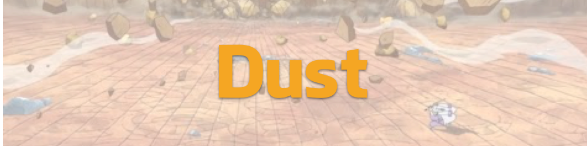

# Dust
Unofficial, simple push notification

[](https://travis-ci.org/onmyway133/Dust)
[](http://cocoadocs.org/docsets/Dust)
[](https://github.com/Carthage/Carthage)
[](http://cocoadocs.org/docsets/Dust)
[](http://cocoadocs.org/docsets/Dust)



The official SDKs do many things. `Dust` does only one thing, which is push notification handling, the rest is under your control

### OneSignal

```swift
func application(application: UIApplication, didFinishLaunchingWithOptions launchOptions: [NSObject : AnyObject]?) -> Bool {
  OneSignal.appID = ""
}

func application(application: UIApplication, didRegisterForRemoteNotificationsWithDeviceToken deviceToken: NSData) {
    OneSignal.handleDeviceToken(data)
}
```

### Urban Airship
### Amazon SNS
### Firebase Notifications

## Installation

**Dust** is available through [CocoaPods](http://cocoapods.org). To install
it, simply add the following line to your Podfile:

```ruby
pod 'Dust'
```

**Dust** is also available through [Carthage](https://github.com/Carthage/Carthage).
To install just write into your Cartfile:

```ruby
github "onmyway133/Dust"
```

**Dust** can also be installed manually. Just download and drop `Sources` folders in your project.

## Author

Khoa Pham, onmyway133@gmail.com

## Contributing

We would love you to contribute to **Dust**, check the [CONTRIBUTING](https://github.com/onmyway133/Dust/blob/master/CONTRIBUTING.md) file for more info.

## License

**Dust** is available under the MIT license. See the [LICENSE](https://github.com/onmyway133/Dust/blob/master/LICENSE.md) file for more info.
